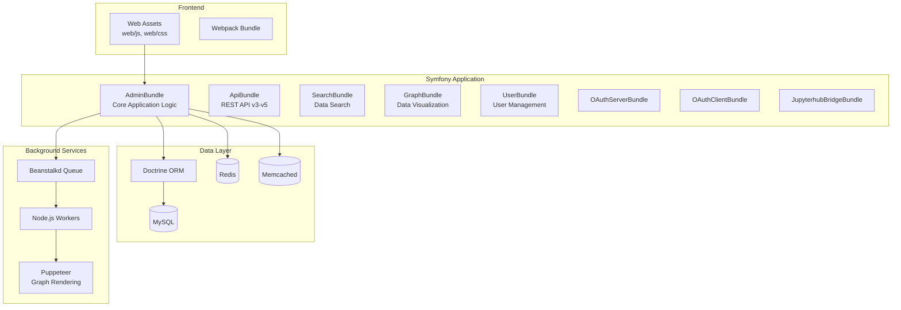

# Open Data Repository - Data Publisher

## Project Overview

A Symfony 3.4 PHP web application for publishing scientific/research data to the web. Enables non-technical users to design web layouts and underlying database structures through a web-based interface.

> [!IMPORTANT]
> This codebase is marked as **BETA** - not intended for production use.

## Architecture



## Directory Structure

| Path | Purpose |
|------|---------|
| `src/ODR/AdminBundle/` | Core application: controllers, entities, services, forms |
| `src/ODR/OpenRepository/` | Feature bundles: API, Search, Graph, OAuth, User, Jupyterhub |
| `app/` | Symfony config, kernel, console |
| `web/` | Public assets: JS (1267 files), CSS (84 files), entry points |
| `background_services/` | Node.js workers for async processing |
| `tests/` | Selenium tests and sample data |

## Key Bundles

### AdminBundle (Core)
- **Controllers** (34): `APIController`, `EditController`, `DisplayController`, `CSVImportController`, `ValidationController`
- **Entities** (67 types): Uses meta-pattern (e.g., `DataFields` + `DataFieldsMeta`)
- **Services** (36): Entity CRUD, caching, permissions, export/import, rendering

### OpenRepository Bundles
- **ApiBundle** - REST API (v3, v4, v5 endpoints)
- **SearchBundle** - Full-text and structured search
- **GraphBundle** - Data visualization (261 files)
- **OAuthServerBundle** / **OAuthClientBundle** - OAuth 2.0 support
- **UserBundle** - User management, extends FOSUserBundle
- **JupyterhubBridgeBundle** - Jupyter notebook integration

## Key Entities (Data Model)

| Entity | Purpose |
|--------|---------|
| `DataType` | Schema definition (like a database table) |
| `DataRecord` | Individual records within a DataType |
| `DataFields` | Field definitions within a DataType |
| `DataRecordFields` | Field values for a specific record |
| `Theme` / `ThemeElement` | Display layout configuration |
| `RenderPlugin` | Custom rendering/processing plugins |
| `Group` / `UserGroup` | Permission groups |

## Technology Stack

| Component | Technology |
|-----------|------------|
| Framework | Symfony 3.4 |
| PHP Dependencies | Doctrine ORM 2.6, FOSUserBundle, FOSOAuthServerBundle, HWIOAuthBundle, Lexik JWT |
| Database | MySQL (via Doctrine) |
| Caching | Redis (SncRedisBundle), Memcached |
| Queue | Beanstalkd (Pheanstalk) |
| Background Workers | Node.js with Puppeteer, nodestalker, ioredis |
| Frontend Build | Webpack |
| Authentication | JWT tokens, OAuth 2.0, FOSUserBundle sessions |

## Common Commands

```bash
# Clear cache
./clear_cache.sh              # Dev environment
./clear_cache_prod.sh         # Production

# Database operations  
bash regenerate_and_update.sh  # Rebuild DB schema

# Background workers
./start_jobs.sh               # Start all background workers

# Testing
./run_phpunit_tests.sh        # PHPUnit tests
php bin/phpunit -c app/phpunit.xml.dist

# Console
php app/console <command>     # Symfony console commands
```

## API Endpoints

Base paths support WordPress integration (prefixed with `/odr/`):

- `/api/v5/token` - JWT token endpoint (latest)
- `/api/v3/token`, `/api/v4/token` - Legacy token endpoints
- `/odr/api/` - Main API routes

## Background Services (Node.js)

Located in `background_services/`:

| Worker | Purpose |
|--------|---------|
| `graph_renderer_daemon.js` | Renders graphs using Puppeteer |
| `record_precache_daemon.js` | Pre-caches record data |
| `ima_*_builder.js` | IMA (mineralogy) data processing |
| `rruff_*_builder.js` | RRUFF database processing |
| `statistics_*.js` | Usage statistics processing |

## Development Notes

1. **Meta Pattern**: Most entities have a paired `*Meta` entity for mutable properties
2. **Themes**: Visual layouts are separate from data structure (DataType → Theme → ThemeElement)
3. **Plugins**: Extensible via RenderPlugin system for custom field display
4. **Permissions**: Group-based with datafield and datatype-level granularity
5. **WordPress Integration**: Routes support optional `/odr` prefix for WP embedding
